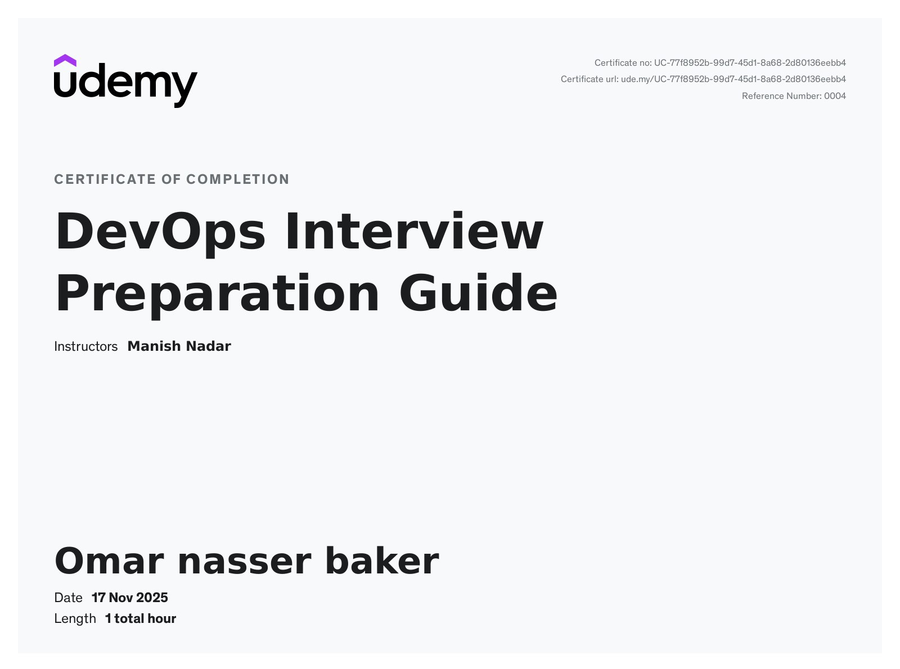
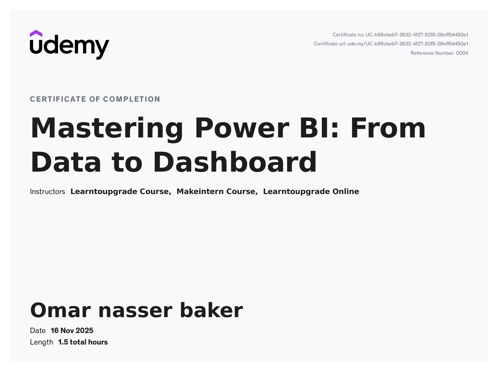
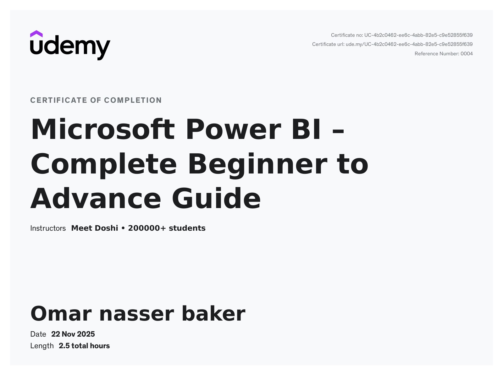

  

Hi
I'm Omar Baker 👨🏿‍💻  

---

 Data Analyst | Data Scientist | LLM Engineer 

I'm passionate about understanding data, building intelligent AI systems, and experimenting with modern Large Language Models.  
I currently work as a **Data Analyst at MT**, with **2 years of experience** in data analysis and AI.

---

## 🔥 What I Do  
- 📊 Analyze and interpret complex data efficiently  
- 🤖 Build Machine Learning & Deep Learning models  
- 🧠 Explore and fine-tune LLMs  
- 🚀 Develop production-ready AI solutions  

---

## 🛠️ Skills & Tools  
**Python • PyTorch • TensorFlow • SQL • Docker • FastAPI • PowerBi   **

---

<table>
  <tr>
    <td></td>
    <td></td>
    <td></td>
  </tr>
  <tr>
    <td></td>
    <td></td>
    <td></td>
  </tr>
  <tr>
    <td></td>
    <td></td>
    <td></td>
  </tr>
   <tr>
    <td></td>
    <td></td>
    <td></td>
  </tr>
</table>

---

  

---

  
  
  
  
  
  
  
  

---

